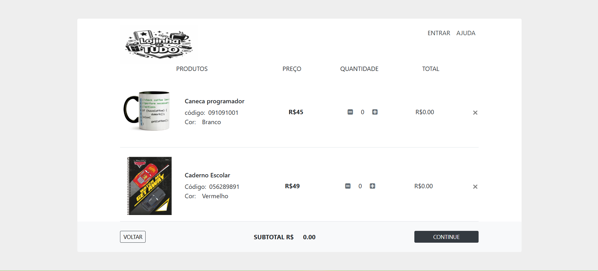

# 📘 Práticas de Programação

Disciplina cursada no **1º período da faculdade**, com foco no desenvolvimento da lógica de programação e construção de soluções utilizando algoritmos e tecnologias web.

---

## 🎯 Objetivo da Disciplina

Desenvolver o raciocínio lógico e a capacidade de resolver problemas computacionais, evoluindo desde conceitos básicos até a construção de aplicações simples utilizando **JavaScript, HTML e CSS**.

---

## 📚 Estrutura da Disciplina

A disciplina foi dividida em 4 unidades progressivas:

### 🧠 Unidade 1 — Linguagens e Algoritmos

* Introdução à lógica de programação
* Conceitos de algoritmos
* Estrutura básica de programas
* Representação de soluções

---

### 🔀 Unidade 2 — Tomada de Decisão e Laços de Repetição

* Estruturas condicionais (`if`, `else`)
* Operadores lógicos
* Estruturas de repetição (`for`, `while`)
* Controle de fluxo

---

### 📦 Unidade 3 — Coleções e Funções

* Arrays (listas)
* Manipulação de dados
* Criação e uso de funções
* Modularização do código

---

### 🚀 Unidade 4 — Programando Soluções com JavaScript, HTML e CSS

Nesta unidade foi desenvolvido um **projeto prático**, consolidando todos os conceitos aprendidos anteriormente.

💡 A proposta foi sair da teoria e construir uma aplicação real utilizando tecnologias web.

---

## 🛠 Projeto Final — Carrinho de Compras

O projeto consistiu na construção de um **carrinho de compras**, utilizando:

* HTML (estrutura)
* CSS (estilização)
* JavaScript (lógica)
* Bootstrap (framework front-end)

## 🖼️ Preview do Projeto

<p align="center">
  
</p>

### 📌 Objetivos do Projeto

* Aplicar lógica de programação em um cenário real
* Integrar diferentes tecnologias
* Trabalhar com manipulação de elementos na interface
* Entender o uso de templates prontos

---

## ⚙️ Estrutura do Projeto

```bash
├── carrinho-de-compras/
│   ├── assets/
│   ├── index.html
│   ├── carrinho.css
│   ├── carrinho.js
│
└── README.md
```

---

## ▶️ Como executar

Este projeto faz parte de um repositório maior contendo toda a minha trajetória acadêmica.

---

### 🔽 1. Clone o repositório

```bash
git clone git@github.com:mffdeo/faculdade-ads.git
```

---

### 📁 2. Acesse a pasta do projeto

```bash
cd faculdade-ads/01-periodo/praticas-de-programacao/carrinho-de-compras
```

---

### 🌐 3. Execute o projeto

Abra o arquivo `index.html` no navegador.

---

## 💡 Observação

Este projeto foi desenvolvido como parte da disciplina **Práticas de Programação**, no 1º período da graduação, com o objetivo de aplicar na prática conceitos de:

* Lógica de programação
* Estruturas de decisão e repetição
* Funções e manipulação de dados
* Integração com HTML, CSS e JavaScript


---

## 🧠 Principais Aprendizados

* Pensamento lógico aplicado à programação
* Estruturação de algoritmos
* Manipulação de dados com JavaScript
* Integração entre HTML, CSS e JS
* Uso de frameworks como Bootstrap
* Desenvolvimento de aplicações simples do zero

---

## 📎 Observações

A Unidade 4 funciona como uma **consolidação prática** de toda a disciplina, reunindo os conceitos das três primeiras unidades em um único projeto aplicado.

---

## 📌 Status

✅ Disciplina concluída
📅 1º período da graduação

---

## 🚀 Evolução

Este projeto representa o início da jornada no desenvolvimento de software e serve como base para projetos mais avançados nos períodos seguintes.
